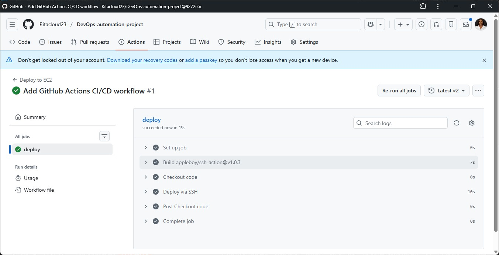
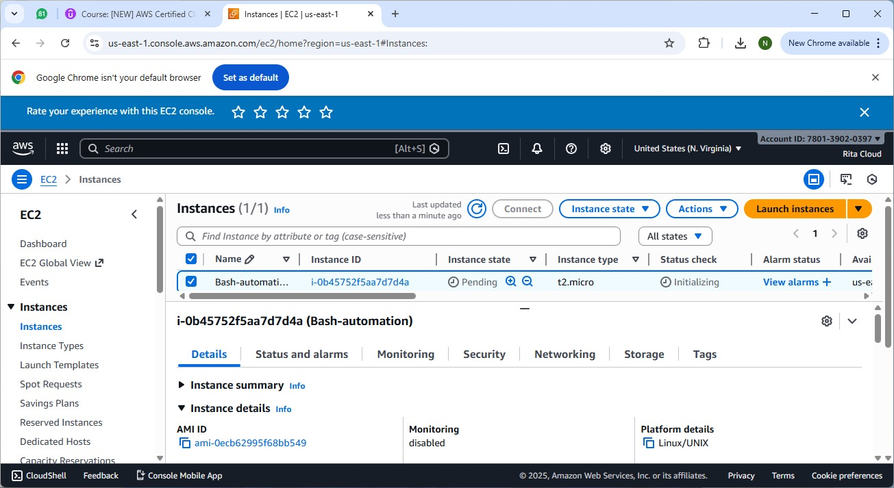

# DevOps Automation Project – CI/CD on AWS EC2 (Docker-Based)

## Overview
This project demonstrates a complete **Docker-based CI/CD pipeline**
that automatically deploys a web application to an **AWS EC2 instance**
using **GitHub Actions and SSH-based automation**.

The project reflects a real-world DevOps journey, evolving from a
traditional **Nginx deployment** to a fully **containerized Docker deployment**
with zero manual server intervention.

---

## Architecture
- Source Code: GitHub Repository
- CI/CD Tool: GitHub Actions
- Server: AWS EC2 (Ubuntu)
- Container Runtime: Docker
- Web Server (Containerized): Nginx
- Deployment Method: SSH + Bash Script

---

## CI/CD Workflow (Current – Docker Deployment)
1. Code is pushed to the `main` branch
2. GitHub Actions workflow is triggered
3. Pipeline connects securely to the EC2 instance via SSH
4. Application files are updated on the server
5. Docker image is built on EC2
6. Existing container is stopped and removed (if running)
7. A new Docker container is deployed and exposed on port `80`
8. Application becomes live via the EC2 public IP

---

## Key Learnings
- Built Docker images for web applications
- Automated Docker deployments using GitHub Actions
- Deployed containerized applications on AWS EC2
- Solved real-world DevOps issues (port conflicts, container replacement)
- Implemented zero-downtime style CI/CD workflows

---

## Proof of Work

### GitHub Actions – Successful Docker CI/CD Pipeline

### Dockerized Application Running on AWS EC2
)

### AWS EC2 Instance Running

---

## Outcome
A fully automated **Docker-based CI/CD pipeline** that deploys applications
to AWS EC2 with **zero manual server intervention**, demonstrating
production-style DevOps practices.
