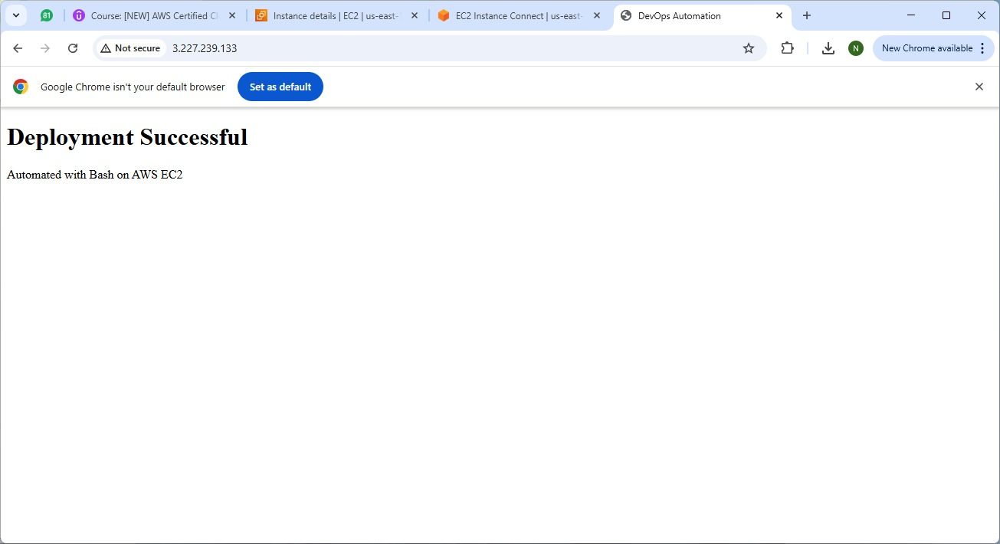

# DevOps Automation Project – CI/CD to AWS EC2

## Overview
This project demonstrates a complete **CI/CD pipeline** that automatically deploys a web application to an **AWS EC2 instance** using **GitHub Actions and SSH-based deployment**.

The goal is to eliminate manual server interaction and achieve a repeatable, reliable deployment workflow.

---

## Architecture
- Source Code: GitHub Repository
- CI/CD: GitHub Actions
- Server: AWS EC2 (Ubuntu)
- Web Server: Nginx
- Deployment Method: SSH + Bash Script

---

## CI/CD Workflow
1. Code is pushed to the `main` branch
2. GitHub Actions workflow is triggered
3. Pipeline connects securely to EC2 via SSH
4. Deployment script runs automatically
5. Nginx serves the updated application

---

## Key Learnings
- Implemented automated deployments using GitHub Actions
- Configured secure SSH access for CI/CD pipelines
- Automated Nginx-based application deployment
- Applied real-world DevOps CI/CD practices

---

## Proof of Work

### GitHub Actions – Successful CI/CD Pipeline

### Live Application Running on EC2

### AWS EC2 Instance Running

---

## Outcome
A fully automated deployment pipeline with **zero manual server intervention**.
